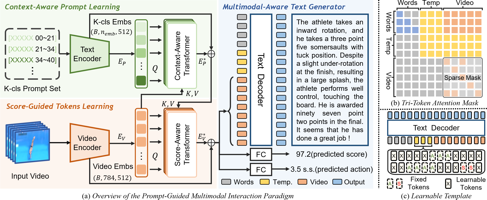
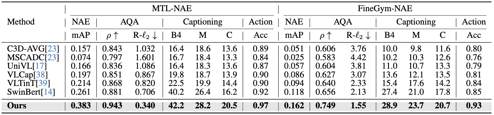
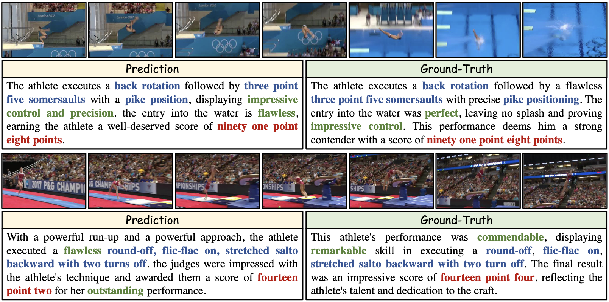
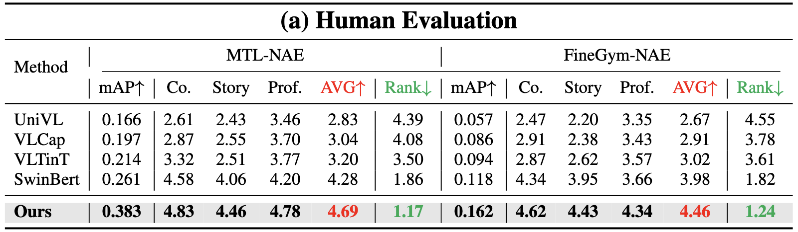
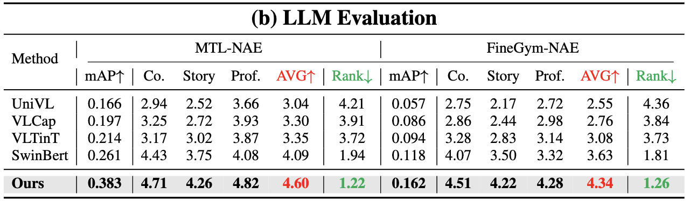

# 
Narrative Action Evaluation with Prompt-Guided Multimodal Interaction (CVPR 2024)

### 
*[Shiyi Zhang\*](https://shiyi-zh0408.github.io/), [Sule Bai\*](https://sulebai.github.io/), [Guangyi Chen](https://chengy12.github.io/), [Lei Chen](http://ivg.au.tsinghua.edu.cn/people/Lei_Chen/), [Jiwen Lu](http://ivg.au.tsinghua.edu.cn/Jiwen_Lu/), Junle Wang, [Yansong Tang†](https://andytang15.github.io/)*

#### 
[[paper]]() 

This repository contains the PyTorch implementation for the paper "Narrative Action Evaluation with Prompt-Guided Multimodal Interaction" (CVPR 2024)

 Our Code will be released soon... 🏗️ 🚧 🔨

## :paperclip: Abstract

In this paper, we investigate a new problem called **Narrative Action Evaluation (NAE)**. NAE aims to generate **professional commentary** that evaluates the execution of an action. Unlike traditional tasks such as score-based action quality assessment and video captioning involving superficial sentences, NAE focuses on creating **Detailed Narratives in Natural Language**. These narratives provide **intricate descriptions** of **Actions** along with **Objective Evaluations**. NAE is a more challenging task because it **Requires Both Narrative Flexibility and Evaluation Rigor**. One existing possible solution is to use multi-task learning, where narrative language and evaluative information are predicted separately. However, this approach results in reduced performance for individual tasks because of variations between tasks and differences in modality between language information and evaluation information. To address this, we propose a **Prompt-Guided Multimodal Interaction Framework**. This framework utilizes a pair of transformers to facilitate the interaction between different modalities of information. It also uses prompts to transform the score regression task into a video-text matching task, thus enabling task interactivity. To support further research in this field, we **Re-annotate the MTL-AQA and FineGym Datasets** with high-quality and comprehensive action narration. Additionally, we establish benchmarks for NAE. Extensive experiment results prove that our method outperforms separate learning methods and naive multi-task learning methods.

---

## 💡 NAE Task

In comparison to **Action Quality Assessment**, NAE provides rich language $\pmb{\color{rgb(207,115,52)}{Descriptions}}$. When compared to **Video Captioning**, NAE includes much more evaluation information such as $\pmb{\color{rgb(192,0,0)}{Scores}}$, $\pmb{\color{rgb(47,85,151)}{Actions}}$, and $\pmb{\color{rgb(109,149,82)}{Qualitative\ Evaluations}}$, which is often rigorous and granular.

## ⭐️ Pipeline

 

Overview of our Prompt-Guided Multimodal Interaction paradigm. 

## :chart_with_upwards_trend: Comparison with Previous SOTA

Comparison with previous video captioning methods on two benchmarks for NAE task.

## :sparkles: Visual Results

**Qualitative results.** Our model can generate detailed narrations including $\pmb{\color{rgb(192,0,0)}{Scores}}$, $\pmb{\color{rgb(47,85,151)}{Actions}}$, and $\pmb{\color{rgb(109,149,82)}{Qualitative\ Evaluations}}$ to describe and evaluate the actions comprehensively. Notably, the model can analyze the quality of actions by pointing out the details of the execution.

## :bar_chart: Quantitative Comparison

<b>(a) Human Evaluation. (b) LLM Evaluation.</b> We use both the 5-point Likert scale and Rank-based methods. For the 5-point Likert scale, we consider three criteria for each text: Coherence (Co.), Storytelling (Story), and Professionalism (Pro.). Each criterion is rated from 1 to 5 by humans or LLM. The average score (AVG) is then calculated. As for the Rank-based method, for each video, we present all texts generated by each method to humans or LLM and ask them to rank the quality of these texts (rank from 1 to 5). Then we obtain each method’s average ranking (Rank).

## 📧 **Contact**

E-mail:  [shiyi-zh19@mails.tsinghua.edu.cn](mailto:shiyi-zh19@mails.tsinghua.edu.cn)

WeChat: ZSYi-408
